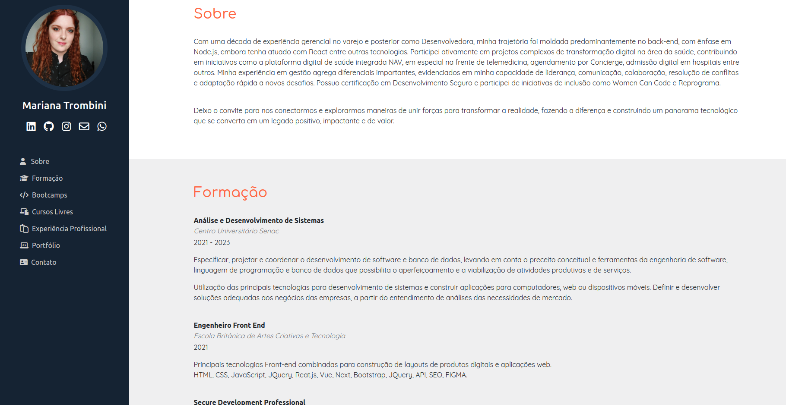
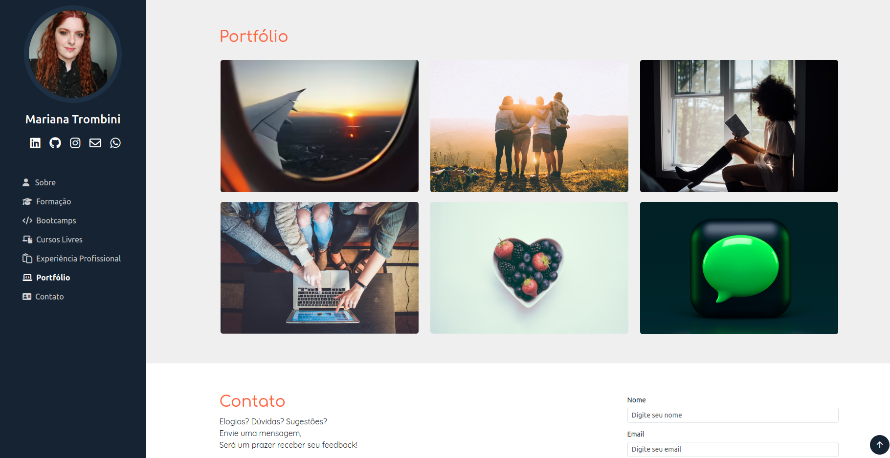
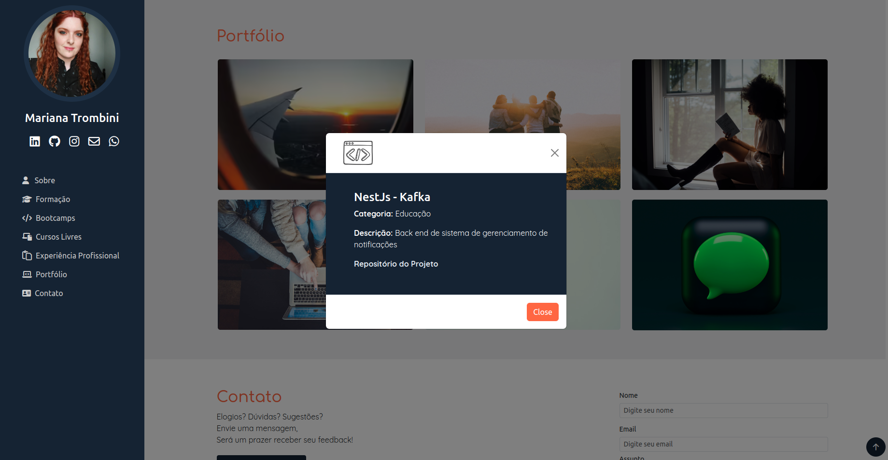
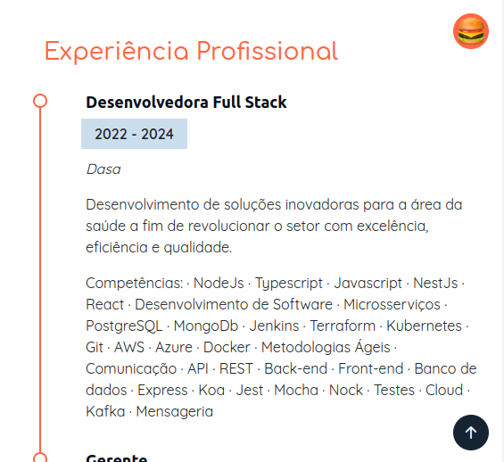
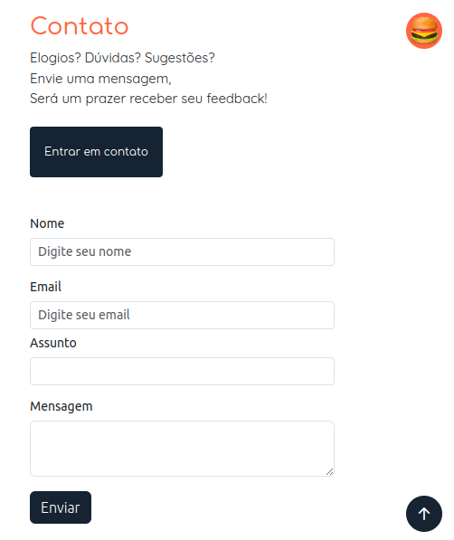
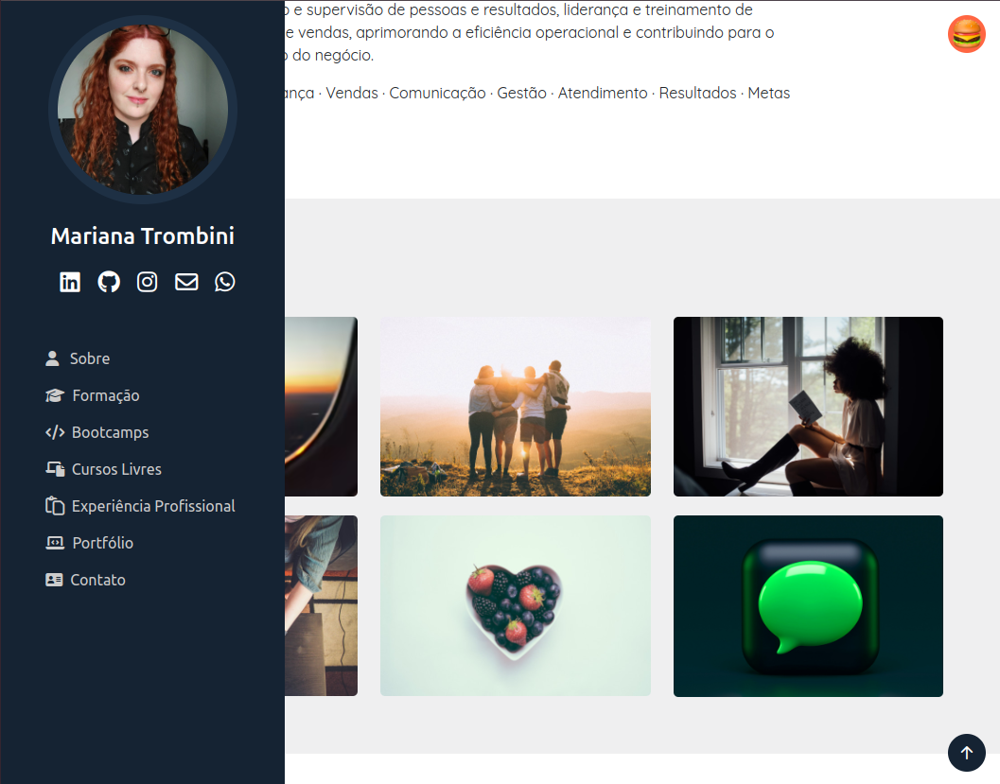

# Mariana Trombini Portfólio

 
 

Projeto desenvolvido para o Challenge do Programa ONE - Oracle Next Education, em parceria com a Alura.

 

## Índice:

- [Mariana Trombini Portfólio](#mariana-trombini-portfólio)
  - [Índice:](#índice)
  - [Funcionalidades](#funcionalidades)
  - [Tecnologias utilizadas](#tecnologias-utilizadas)
  - [Imagens do projeto](#imagens-do-projeto)
  - [Como acessar](#como-acessar)
  - [Autora e contato](#autora-e-contato)

## Funcionalidades

- Design responsivo com menu hambúrguer;
- Validação do formulário de contato;
- Integração com [formsubmit.co.](https://formsubmit.co/) de modo que a mensagem enviada pelo formulário seja entregue ao meu e-mail.

## Tecnologias utilizadas

- JavaScript
- CSS3
- HTML5

## Imagens do projeto

## Como acessar

Para acessar, [clique aqui](https://maritrombini.github.io/challenge-ONE-portfolio/).

## Autora e contato

- LinkedIn: [Mariana Trombini](https://www.linkedin.com/in/mariana--trombini/)
